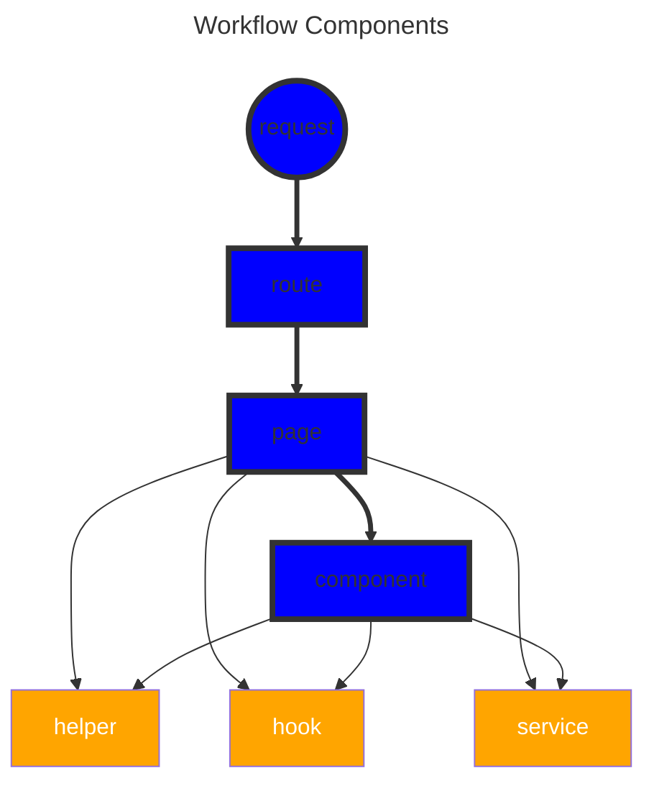
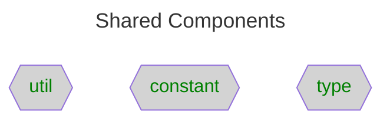

# Application Architecture on Frontend <!-- omit in toc -->

Table of Contents

- [Overview](#overview)
- [Purpose](#purpose)
- [Constraints](#constraints)
- [Recommendations](#recommendations)
- [Types of Files](#types-of-files)
  - [Core - UI](#core---ui)
  - [Core - Business Logic \& Dependencies](#core---business-logic--dependencies)
  - [Complimentary](#complimentary)
- [Design Principles](#design-principles)
- [Checklist](#checklist)
- [Reference](#reference)

## Overview

## Purpose

- Define a clear mapping between `URL` and `page`
- Do not overload `page` with **excessive** states, props and components
- Define common file types that `can split the components` and refactor the business logic the same way

## Constraints

- Be avoid to cross import constants, enums, types and interfaces

## Recommendations

- Always write unit tests for helper files
- Consider write widget tests for component files

## Types of Files

### Core - UI

- pages
  - `UI` imported to routes
  - Call the page according to the path while ignoring the reference keys
  - e.g. route: `projects/:projectId/detail`
  - filename: `ProjectsDetailPage` (ignore `projectId`)
  - single `component`
  - file suffix: `Page.tsx`

- components
  - `UI` not imported to router
  - single `component`
  - file suffix: `tsx`

- routes
  - map the actual page `components` and `URL`
  - array of route `components`
  - file suffix: `-routes.tsx`

### Core - Business Logic & Dependencies

- hooks
  - single custom hook `function`
  - might import business logic from services
  - file suffix: `use(.*).ts`
- helpers
  - single / multiple pure `functions`
  - file suffix: `-helper.ts` or `-helpers.ts`
- services
  - single / multiple `functions`
  - send requests to APIs
  - file suffix: `-service.ts` or `-services.ts`

### Complimentary

- utils
  - contains random calls
  - remote calls
  - file suffix: `ts`
- types
  - single / multiple `types` & `interfaces`
  - file suffix: `-types.ts`
- constants
  - single / multiple `constants` & `enums`
  - file suffix: `-consts.ts`

<!-- ## When to have a new -->

## Design Principles

- Functional Paradigms
- Hexagonal Architecture

## Checklist

- [ ] Is `Business Logic` resolved as pure functions?
- [ ] Can Business Logic extract to be some separate functions?
- [ ] Do states bind to relevant components ONLY?
- [ ] Do components extract as children if under a complicated layout?

## Reference

- [react.dev - Describing the UI](https://react.dev/learn/describing-the-ui "https://react.dev/learn/describing-the-ui")
- [react.dev - Escape Hatches](https://react.dev/learn/escape-hatches "https://react.dev/learn/escape-hatches")
