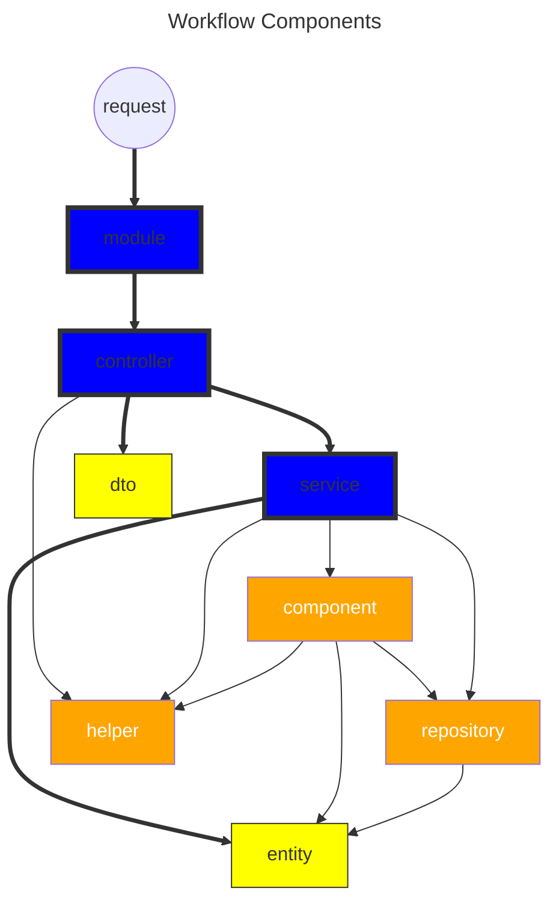
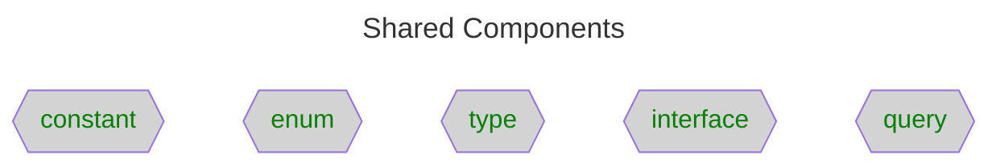

# Application Architecture <!-- omit in toc -->

**Table of Contents**

- [Overview](#overview)
- [Purpose](#purpose)
- [Constraints](#constraints)
- [Recommendations](#recommendations)
- [Types of Component](#types-of-component)
  - [Core](#core)
  - [Core (II)](#core-ii)
  - [Complimentary (I)](#complimentary-i)
  - [Complimentary (II)](#complimentary-ii)
- [When to have a new...](#when-to-have-a-new)
  - [Controller](#controller)
  - [Service](#service)
  - [Helper](#helper)
  - [Component](#component)
- [Design Principles](#design-principles)
- [Checklist](#checklist)
- [Reference](#reference)

## Overview

## Purpose

- Split huge functions into pure functions & impure functions
- Define a clear boundary between ports & adapters
- Test components with a clear definition
- Provide a foundation on refactoring code the same way

## Constraints

- Do not cross import the same level of logic components
- Be avoid to cross import constants, enums, types and interfaces

## Recommendations

- Always write unit tests for helper files

## Types of Component

### Core

- filename = resource name

* messages.module.ts (plural, single class)
* messages.controller.ts (plural, single class)
* messages.service.ts (plural, single class)
* message.entity.ts (singular, single class)
* messages.types.ts (plural, multiple types)
* messages.interfaces.ts (plural, multiple interfaces)

### Core (II)

- filename = same to the class inside

* create-message-request.dto.ts (single class)
* create-message-response.dto.ts (single class)

### Complimentary (I)

- filename = resource name

* messages.helpers.ts (plural, multiple functions)
* messages.queries.ts (plural, multiple functions)
* messages.repositories.ts (plural, multiple functions)
* messages.components.ts (plural, multiple functions)
* messages.enums.ts (plural, multiple enums)
* messages.constants.ts (plural, multiple constants)

### Complimentary (II)

- filename = same to the name inside

* default-decimal-format.constant.ts (one constant, filename = constant name)
* get-to-know-who.helper.ts (one function, filename = name of function name)
* language-switches.component.ts (one function, filename = name of function name)
* subjects.enum.ts (one enum, filename = enum name)

## When to have a new...

### Controller

- Manipulate ONLY ONE resource
- Create a new one if there are some additional requirements
  - specific access right
  - specific checking
- Number of functions = Number of routes

### Service

- Ideally, one controller of `resource A`, one service of `resource A`
- Number of functions IN that service = Number of functions IN that controller

### Helper

- Contain multiple pure functions
- Can be tested without any mocks

### Component

- Is an extension to certain services
- Simplify the logic in services

## Design Principles

- Orthogonality
- Functional Paradigms
- Clean Architecture / Hexagonal Architecture
- (Not) Domain Driven Design at development
  - can be verified only after launched
  - refactor if necessary

## Checklist

- [ ] Are `Business Logics` resolved as pure functions?
- [ ] Are the dependencies resolved among interfaces of the functions?
- [ ] Is Side Effect applied at the end?
- [ ] Is Side Effect visible?
- [ ] Does the code with similar `Business Logics` grouped in the similar way?

## Reference

- [Orthogonality in Software Engineering](https://www.freecodecamp.org/news/orthogonality-in-software-engineering "https://www.freecodecamp.org/news/orthogonality-in-software-engineering")
- [The Pragmatic Programmer, 20th Anniversary Edition](https://pragprog.com/titles/tpp20/the-pragmatic-programmer-20th-anniversary-edition "https://pragprog.com/titles/tpp20/the-pragmatic-programmer-20th-anniversary-edition")
- [The Clean Code Blog](https://blog.cleancoder.com/uncle-bob/2012/08/13/the-clean-architecture.html "https://blog.cleancoder.com/uncle-bob/2012/08/13/the-clean-architecture.html")
- [Get Your Hands Dirty on Clean Architecture (2nd edition)](https://thombergs.gumroad.com/l/gyhdoca "https://thombergs.gumroad.com/l/gyhdoca")
