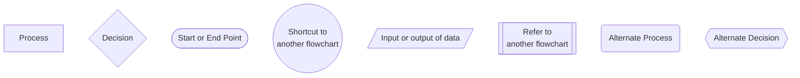
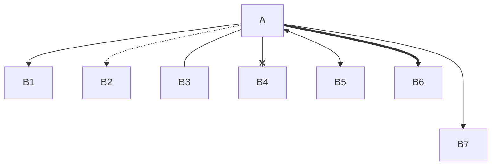

# Diagram as Code

For compatibility / auditing reasons, we should draw our diagrams by code

## Choice of toolings
[MermaidJS](https://mermaid.js.org "https://mermaid.js.org") - C4 Diagrams / ERD, Github supports preview  
[PlantUML](https://plantuml.com "https://plantuml.com") - A more flexible layout / advanced diagrams  
[Structurizr DSL](https://structurizr.com "https://structurizr.com")  
[mermerd](https://github.com/KarnerTh/mermerd "https://github.com/KarnerTh/mermerd") - ERD from Database

```bash
./mermerd -c "postgresql://{USERNAME}:{PASSWORDD}@{PATH}/{DATABASE}" -s public
```

## Before drawing, ask:
- (People) Who read the digrams?  
- (People) Who can help maintaining the diagrams?  
- (Context) Technical vs Business?  
- (Context) How much information?  
- (Metholodogies) What diagrams?  
    - Context Diagrams  
    - State Diagrams  
    - Sequence Diagrams  
    - Use Case Diagrams  
    - Flow Charts

## After drawn, think about:
- (People) Who can help reviewing the diagrams?  
- (Context) Can readers search the context?  
- (Context) Check typos  
- (Context) Avoid to have more than 50 nodes & assoications
- (Context) Provide title if possible

```markdown
---
title: Hello Title
config:
  theme: base
  themeVariables:
    primaryColor: "#00ff00"

---
flowchart
	Hello --> World
```

## Advanced Use
- themes
    - default - good in most cases
    - base - for customisation
    - dark - good for dark mode
    - forest - green gradient palette
    - neutral - printing on paper

## Legends
### Flowcharts

- Directions
    - LR (->)
    - RL (<-)
    - TB (v)
    - BT (^)

## Shapes


### Remarks
**Rectangle**: Most common shapes  
**Diamond**: Make the text short  
**Rounded Rectangle**: Dashed edge to the shape  
**Hexagon**: Alternate shape for decsion - a longer text is provided  

## Edges
- chaining
```markdown
flowchart
A --> B & C --> D
```


- types
```markdown
flowchart
A --> B1 % arrow, data / process flow
A -.-> B2 % dash, optional
A --- B3 % open, assoication between events
A --x B4 % not reachable
A <--> B5 % bidrectional, save space
A ==> B6 % thicker version, major flow
A ---> B7 % longer edge
```


- text
```markdown
A -->|go| B % more flexible
A --|go|--> B % more natural
```

- subgraph - alternative to subroutine, respresent something different from flowcharts

## Reference
- [Diagram as Code](https://blog.bytebytego.com/p/diagram-as-code "https://blog.bytebytego.com/p/diagram-as-code")  
- [The Official Guide to Mermaid.js](https://mermaid.js.org/landing "https://mermaid.js.org/landing")  
- [Creating Software with Modern Diagramming Techniques](https://pragprog.com/titles/apdiag/creating-software-with-modern-diagramming-techniques "https://pragprog.com/titles/apdiag/creating-software-with-modern-diagramming-techniques")
