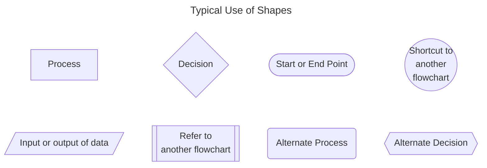
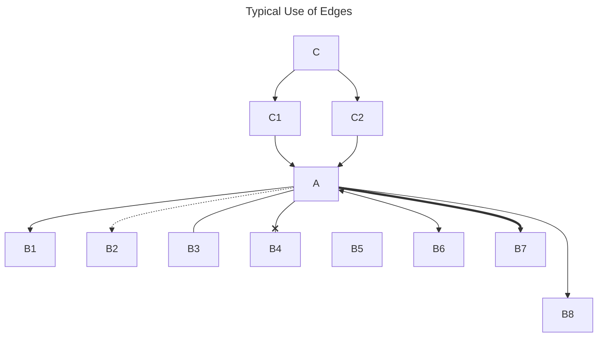

# Diagram as Code <!-- omit in toc -->

Table of Contents

- [Choice of toolings](#choice-of-toolings)
- [Advanced Use of Mermaid Themes](#advanced-use-of-mermaid-themes)
- [Legends](#legends)
  - [Flowcharts](#flowcharts)
- [Shapes](#shapes)
  - [Remarks](#remarks)
- [Edges](#edges)
- [Reference](#reference)

For compatibility / auditing reasons, draw our diagrams by code

## Choice of toolings

- [MermaidJS](https://mermaid.js.org "https://mermaid.js.org") - C4 Diagrams / ERD, Github supports preview
- [PlantUML](https://plantuml.com "https://plantuml.com") - A more flexible layout / advanced diagrams
- [Structurizr DSL](https://structurizr.com "https://structurizr.com")
- [mermerd](https://github.com/KarnerTh/mermerd "https://github.com/KarnerTh/mermerd") - ERD from Database

  ```bash
  ./mermerd \
    --useAllTables \
    --schema public \
    --outputFileName "erd.mmd" \
    --connectionString "postgresql://{USERNAME}:{PASSWORD}@{PATH}/{DATABASE}"
  ```

## Advanced Use of Mermaid Themes

- themes
  - default - good in most cases
  - base - for customisation
  - dark - good for dark mode
  - forest - green gradient palette
  - neutral - printing on paper

## Legends

### Flowcharts

- Directions
  - LR (->)
  - RL (<-)
  - TB (v)
  - BT (^)

## Shapes

```markdown
---
title: Typical Use of Shapes
---

flowchart
  rectangle[Process]
  diamond{Decision}
  stadium([Start or End Point])
  circle((Shortcut to<br />another<br />flowchart))

  parallelogram[/Input or output of data/]
  subroutine[[Refer to<br />another flowchart]]
  roundedRectangle(Alternate Process)
  hexagon{{Alternate Decision}}

  rectangle ~~~ parallelogram
  diamond ~~~ subroutine
  stadium ~~~ roundedRectangle
  circle ~~~ hexagon
```



### Remarks

- **Diamond**: Should make the text short
- **Rounded Rectangle**: Dashed edge to the shape
- **Hexagon**: Alternate shape for decision
  - a longer text is provided

## Edges

```markdown
---
title: Typical Use of Edges
---

flowchart
  C --> C1 & C2 --> A %% Chaining & Cross Mapping
  A --> B1 %% arrow, data / process flow
  A -.-> B2 %% dash, optional
  A --- B3 %% open, association between events
  A --x B4 %% not reachable
  A ~~~ B5 %% positioning, hidden
  A <--> B6 %% bidirectional, save space
  A ==> B7 %% thicker version, major flow
  A ---> B8 %% longer edge
```



```markdown
  A -->|go| B %% more flexible
  A --|go|--> B %% more natural
```

- subgraph - alternative to subroutine, represent something different from flowcharts

Style

- If it is a SMALL diagram, just code whatever you think it is the most efficient
- If it is a LARGE diagram, usually more than 15 nodes, manage your CODE structurally

```markdown
---
title: Flowchart on Support & Operation Escalation
---

%% 1. Events

%% start point / termination points
issue([Receive an issue])

%% process
support-ticket[Create a<br />Support Ticket]

%% decision
categorize{Categorize}

%% 2. Style
style ops-escalate fill:blue,color:#fff

%% 3. Associations
issue --> support-ticket
```

## Reference

- [Diagram as Code](https://blog.bytebytego.com/p/diagram-as-code "https://blog.bytebytego.com/p/diagram-as-code")
- [The Official Guide to Mermaid.js](https://mermaid.js.org/landing "https://mermaid.js.org/landing")
- [Creating Software with Modern Diagramming Techniques](https://pragprog.com/titles/apdiag/creating-software-with-modern-diagramming-techniques "https://pragprog.com/titles/apdiag/creating-software-with-modern-diagramming-techniques")
