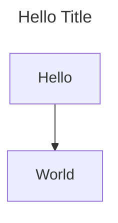

# Diagram as Code <!-- omit in toc -->

**Table of Contents**

- [1. Choice of toolings](#1-choice-of-toolings)
- [2. Before drawing, ask:](#2-before-drawing-ask)
- [3. After drawn, think about:](#3-after-drawn-think-about)
- [4. Advanced Use](#4-advanced-use)
- [5. Legends](#5-legends)
  - [5.1. Flowcharts](#51-flowcharts)
- [6. Shapes](#6-shapes)
  - [6.1. Remarks](#61-remarks)
- [7. Edges](#7-edges)
- [8. Reference](#8-reference)

For compatibility / auditing reasons, we should draw our diagrams by code

## 1. Choice of toolings

[MermaidJS](https://mermaid.js.org "https://mermaid.js.org") - C4 Diagrams / ERD, Github supports preview  
[PlantUML](https://plantuml.com "https://plantuml.com") - A more flexible layout / advanced diagrams  
[Structurizr DSL](https://structurizr.com "https://structurizr.com")  
[mermerd](https://github.com/KarnerTh/mermerd "https://github.com/KarnerTh/mermerd") - ERD from Database

```bash
./mermerd \
    --useAllTables \
    --schema public \
    --outputFileName "erd.mmd" \
    --connectionString "postgresql://{USERNAME}:{PASSWORD}@{PATH}/{DATABASE}"
```

## 2. Before drawing, ask:

- (People) Who read the diagrams?
- (People) Who can help maintaining the diagrams?
- (Context) Technical vs Business?
- (Context) How much information?
- (Methodologies) What diagrams?
  - Context Diagrams
  - State Diagrams
  - Sequence Diagrams
  - Use Case Diagrams
  - Flow Charts

## 3. After drawn, think about:

- (People) Who can help reviewing the diagrams?
- (Context) Can readers search the context?
- (Context) Check typos
- (Context) Avoid to have more than 50 nodes & associations
- (Context) Provide title if possible
- (Context) Provide comments in CODE if necessary

```markdown
---
title: Hello Title
---

flowchart
Hello --> World
```



## 4. Advanced Use

- themes
  - default - good in most cases
  - base - for customisation
  - dark - good for dark mode
  - forest - green gradient palette
  - neutral - printing on paper

## 5. Legends

### 5.1. Flowcharts

- Directions
  - LR (->)
  - RL (<-)
  - TB (v)
  - BT (^)

## 6. Shapes

```markdown
---
title: Typical Use of Shapes
---

flowchart

    rectangle[Process]
    diamond{Decision}
    stadium([Start or End Point])
    circle((Shortcut to \n another \n flowchart))

    parallelogram[/Input or output of data/]
    subroutine[[Refer to\nanother flowchart]]
    roundedRectangle(Alternate Process)
    hexagon{{Alternate Decision}}

    rectangle ~~~ parallelogram
    diamond ~~~ subroutine
    stadium ~~~ roundedRectangle
    circle ~~~ hexagon
```


### 6.1. Remarks

**Diamond**: Should make the text short  
**Rounded Rectangle**: Dashed edge to the shape  
**Hexagon**: Alternate shape for decision - a longer text is provided

## 7. Edges

```markdown
---
title: Typical Use of Edges
---

flowchart

    C --> C1 & C2 --> A %% Chaining & Cross Mapping
    A --> B1 %% arrow, data / process flow
    A -.-> B2 %% dash, optional
    A --- B3 %% open, association between events
    A --x B4 %% not reachable
    A ~~~ B5 %% positioning, hidden
    A <--> B6 %% bidirectional, save space
    A ==> B7 %% thicker version, major flow
    A ---> B8 %% longer edge
```


```markdown
    A -->|go| B %% more flexible
    A --|go|--> B %% more natural
```

- subgraph - alternative to subroutine, represent something different from flowcharts

Style

- If it is a SMALL diagram, just code whatever you think it is the most efficient
- If it is a LARGE diagram, usually more than 15 nodes, manage your CODE structurally

```markdown
---
title: Flowchart on Support & Operation Escalation
---

%% 1. Events

%% start point / termination points
issue([Receive an issue])

%% process
support-ticket[Create a\nSupport Ticket]

%% decision
categorize{Categorize}

%% 2. Style
style ops-escalate fill:blue,color:#fff

%% 3. Associations
issue --> support-ticket
```

## 8. Reference

- [Diagram as Code](https://blog.bytebytego.com/p/diagram-as-code "https://blog.bytebytego.com/p/diagram-as-code")
- [The Official Guide to Mermaid.js](https://mermaid.js.org/landing "https://mermaid.js.org/landing")
- [Creating Software with Modern Diagramming Techniques](https://pragprog.com/titles/apdiag/creating-software-with-modern-diagramming-techniques "https://pragprog.com/titles/apdiag/creating-software-with-modern-diagramming-techniques")
