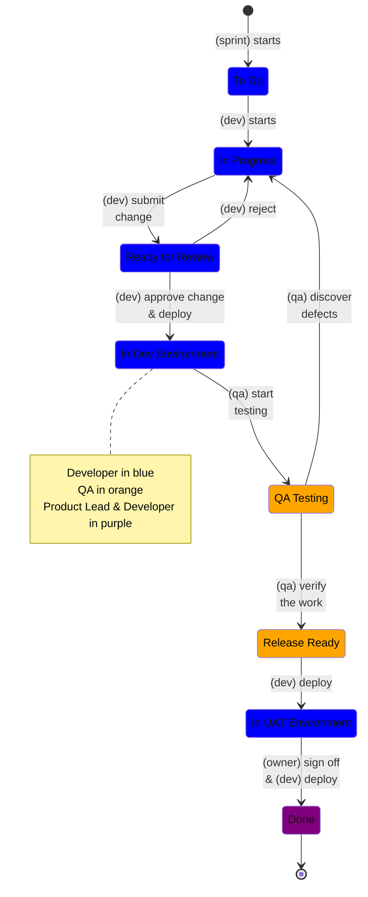

# General <!-- omit in toc -->

## Philosophy

### [Boy/Girl-scout Engineer](https://www.stepsize.com/blog/how-to-be-an-effective-boy-girl-scout-engineer)

`Always leave the code better than you found it`

You should consider tidy up the code at the same time you submit a change.

Like

- extract constants
- extract enums
- name some complicated anonymous functions
- leave some application logs
- tidy up the content of application log

### Deliver your change with quality and confidence

`Write more pure functions and automated tests`

- `functions` expects that inputs and outputs are always present.
- `pure` describes a function that will not change those `non-outputs`. In JS/TS, be aware of `Promise` and `async/await`, reading current time, or generating some random stuff.

### Development Methodology

We follow [Scrum](scrum.md) with a [lean](../how-we-share/lean.md) mindset.

### Development Flow

## Resources

- [Functional-light Javascript](https://github.com/getify/Functional-Light-JS "https://github.com/getify/Functional-Light-JS")
- [You Don't Know JS](https://github.com/getify/You-Dont-Know-JS "https://github.com/getify/You-Dont-Know-JS")
- [O'Reilly for Public Libraries](https://www.hkpl.gov.hk/tc/e-resources/e-books/disclaimer/180265/o-reilly-for-public-libraries "https://www.hkpl.gov.hk/tc/e-resources/e-books/disclaimer/180265/o-reilly-for-public-libraries")
