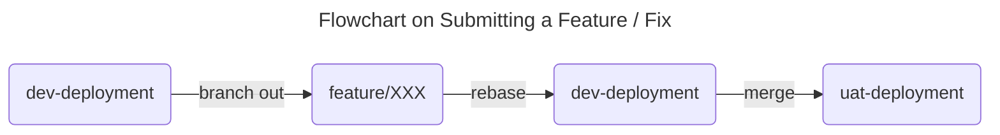
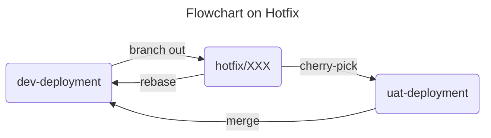
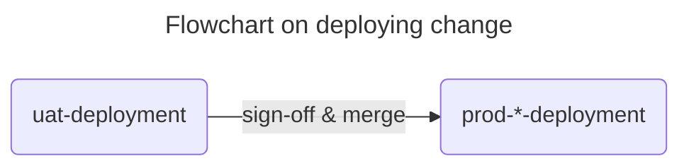

# Git Workflow

- We are using `trunk-based development`, you can check [here](https://www.atlassian.com/continuous-delivery/continuous-integration/trunk-based-development "Trunk-based development - Learn why this version control management practice is common practice among DevOps teams."), [here](https://trunkbaseddevelopment.com "Trunk Based Development: Introduction") and [here](https://cloud.google.com/architecture/devops/devops-tech-trunk-based-development "Prevent merge-conflict hassles with trunk-based development practices")
- We promote and aim at transiting to a linear flow based on `dev-deployment`
- The change from `dev-deployment` to all `uat-deployment` MUST be done through `git merge`
- The change from `uat-deployment` to all `prod-deployment` MUST be done through `git merge`

### Development

### Hotfix

### Deployment

