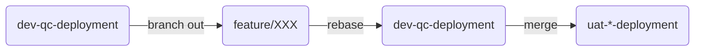
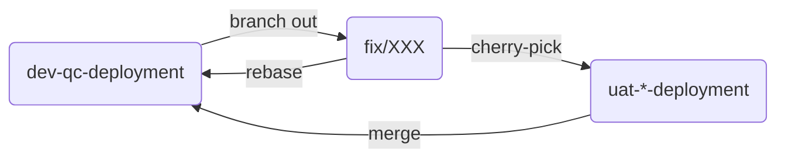
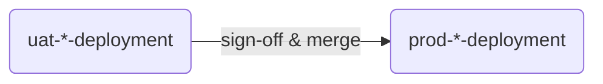

# Git Workflow

- We are transiting to `trunk-based development`, you can check [here](https://www.atlassian.com/continuous-delivery/continuous-integration/trunk-based-development), [here](https://trunkbaseddevelopment.com/) and [here](https://cloud.google.com/architecture/devops/devops-tech-trunk-based-development)
- We promote and aim at transiting against a linear flow based on `dev-qc-deployment`
- The change from `dev-qc-deployment` to all `uat-*-deployment` MUST be done through `git merge`
- If the client does not have its own UAT site, the source will go from `uat-anz-deployment`

### Development

### Fix

### Deployment

