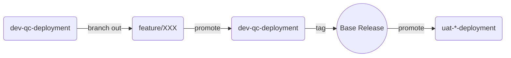
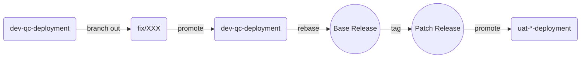

# Gitflow (Drafted)

- We promote and aim at transiting against a linear flow based on `dev-qc-deployment`.
- The change from `dev-qc-deployment` to all `uat-*-deployment` MUST be done through `git rebase`.
- If the clients do not have its own UAT branch, the source will go from `uat-apac-deployment`.

### Development

### Fix

### Deployment

