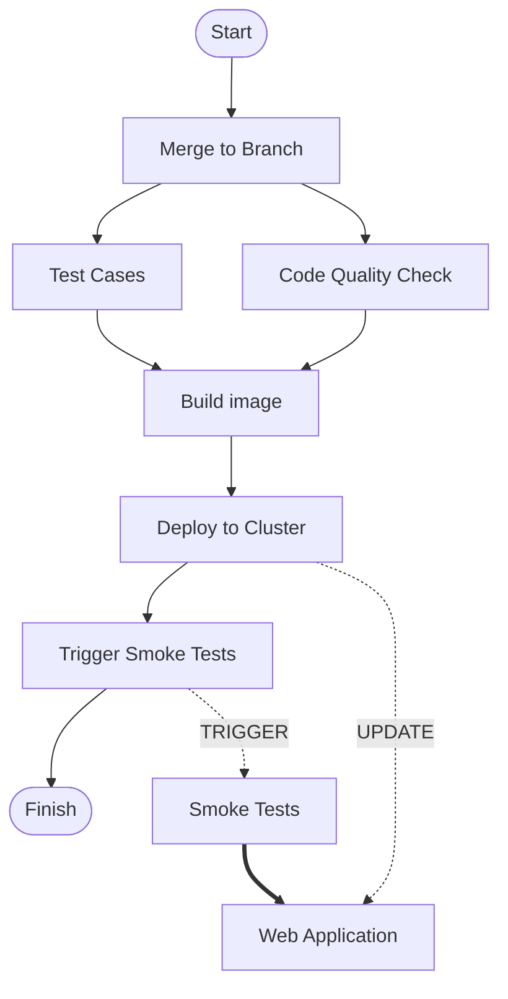

# Smoke Tests <!-- omit in toc -->

- [What is it?](#what-is-it)
- [Playwright](#playwright)
- [Test Workflow](#test-workflow)
- [How do we execute the smoke tests?](#how-do-we-execute-the-smoke-tests)
- [Playwright - what it offers](#playwright---what-it-offers)
  - [Tips to write test cases](#tips-to-write-test-cases)
  - [Be avoid to run same action to run for each test](#be-avoid-to-run-same-action-to-run-for-each-test)
    - [Use Case: Authentication](#use-case-authentication)
  - [How to publish test reports](#how-to-publish-test-reports)
- [How other people do the smoke tests](#how-other-people-do-the-smoke-tests)
- [Reference](#reference)

## What is it?

A QUICK, SIMPLE and most critical test cases to verify the system is working properly

## [Playwright](https://playwright.dev "https://playwright.dev")

A test framework that can simulate how we interact with browsers automatically

## Test Workflow



## How do we execute the smoke tests?

- Go to all the pages user will see and see if we can load the content without errors
- Go through the typical flows and see if the functions are working properly

## Playwright - what it offers

- provide nodejs runtime
- be fast to start
- can run in parallel
- auto-wait until components are ready
- support test execution recording & screen capture
- support test recording
- upload test reports to github pages with available [CI scripts](https://www.youtube.com/watch?v=F_nUVHBhrow&pp=ygUYI3Rlc3RyZXBvcnRzaW5wbGF5d3JpZ2h0)
  - With an enterprise plan on github, the github pages can [set the visibility](https://docs.github.com/en/enterprise-cloud@latest/pages/getting-started-with-github-pages/changing-the-visibility-of-your-github-pages-site) as `private`

### Tips to write test cases

- Most locators are `contains`. If you check the exact value, use `exact: true`

  ```typescript
  page.getByRole("heading", { name: "Company" }); // Heading with text `Company`
  page.getByRole("heading", { name: "Company", exact: true }); // Heading with EXACT text `Company`
  ```

  - To see the details of locator, check [here](https://playwright.dev/docs/api/class-locator "https://playwright.dev/docs/api/class-locator")

- Determine when to use `async matchers` and `generic matchers`

- Consider soft assertions

  ```typescript
  // Make a few checks that will not stop the test when failed...
  await expect.soft(page.getByTestId("status")).toHaveText("Success");

  // ... and continue the test to check more things.
  await page.getByRole("link", { name: "next page" }).click();
  ```

- Apply `tag` appropriately. It can make the test time shorter by running the subset of the test suites

  ```typescript
  npx playwright test --grep "@fast|@slow"
  npx playwright test --grep "(?=.*@fast)(?=.*@slow)"
  ```

- [Aria Snapshots](https://playwright.dev/docs/aria-snapshots) can provide a structural look on DOM level.

  ```typescript
  await expect(page.locator('.nxp-app-header')).toMatchAriaSnapshot(
    `
  - img
  - text: /NEXPLORE\\(v6\\.\\d+\\.\\d+\\)/
  - combobox
  - text: /\\w \\w/
  - img
  - button "menu":
    - img "menu"
  `,
    { timeout: 2000 },
  );
  ```

- A `test.step` can be used if better clarity

  ```typescript
  test.describe('NEXPLORE SYSTEM', () => {
    test('Home', async ({ page }) => {
      await test.step('go there', async () => {
        await page.goto(`entities`);
        await page.goto(`entities/${ENTITY_ID}/workspace`);
      });
      await test.step('check the content', async () => {
        await expect.soft(page.getByText('Workspace').first()).toBeVisible();
        await expect(page.locator('.nxp-app-header')).toMatchAriaSnapshot(
          `
        - img
        - text: /NEXPLORE\\(v6\\.\\d+\\.\\d+\\)/
        - combobox
        - text: /\\w \\w/
        - img
        - button "menu":
          - img "menu"
      `,
          { timeout: 2000 },
        );
      });
    });
  });
  ```

- Please check [Playwright Best Practices](https://playwright.dev/docs/best-practices "https://playwright.dev/docs/best-practices") for more information

### Be avoid to run same action to run for each test

Sometime we only want to run some actions once through the test execution. e.g. Authentication

#### Use Case: Authentication

1. Update auth as a new `project` in `playwright.config.ts`

   ```typescript
   import { defineConfig, devices } from "@playwright/test";

   export default defineConfig({
     projects: [
       // Step 1: Setup project
       { name: "setup", testMatch: /.*\.setup\.ts/ },

       {
         name: "chromium",
         use: {
           ...devices["Desktop Chrome"],
           // Step 2: Specify where to store the auth information
           storageState: "playwright/.auth/user.json",
         },
         dependencies: ["setup"],
       },
     ],
   });
   ```

2. Add `login.setup.ts`

   ```typescript
   import { test as setup } from "@playwright/test";
   import { getConfiguration } from "../configs/getConfiguration";

   const { CORE_FRONTEND_ENDPOINT } = getConfiguration();
   const AUTH_FILE = "playwright/.auth/user.json";

   setup("Login", async ({ page }) => {
     await page.goto(CORE_FRONTEND_ENDPOINT);
     await page.getByPlaceholder("Email").fill(process.env.USER_EMAIL);
     await page.getByPlaceholder("Password").fill(process.env.USER_PASSWORD);
     await page.getByRole("button", { name: "Log In" }).click();

     await page.context().storageState({ path: AUTH_FILE });
   });
   ```

3. Exclude the auth session file in git

   ```bash
   mkdir -p playwright/.auth
   echo $'\nplaywright/.auth' >> .gitignore
   ```

Extract from: [https://playwright.dev/docs/auth](https://playwright.dev/docs/auth "https://playwright.dev/docs/auth")

### How to publish test reports

We prefer [publishing from a branch](https://docs.github.com/en/enterprise-cloud@latest/pages/getting-started-with-github-pages/configuring-a-publishing-source-for-your-github-pages-site "https://docs.github.com/en/enterprise-cloud@latest/pages/getting-started-with-github-pages/configuring-a-publishing-source-for-your-github-pages-site") because it can combine the reports easier

- Only enterprise version could set github pages visibility privately

- Please refer to our [workflow](./smoke-tests-playwright.yml) file

## How other people do the smoke tests

- [VS Code](https://github.com/microsoft/vscode/wiki/Smoke-Test "https://github.com/microsoft/vscode/wiki/Smoke-Test")

## Reference

- [MS Playwright Tutorial](https://learn.microsoft.com/en-us/training/modules/build-with-playwright "https://learn.microsoft.com/en-us/training/modules/build-with-playwright")
- [Playwright Youtube Channel](https://www.youtube.com/@Playwrightdev "https://www.youtube.com/@Playwrightdev")
- [Smoke Tests](<"https://en.wikipedia.org/wiki/Smoke_testing_(software)">)
