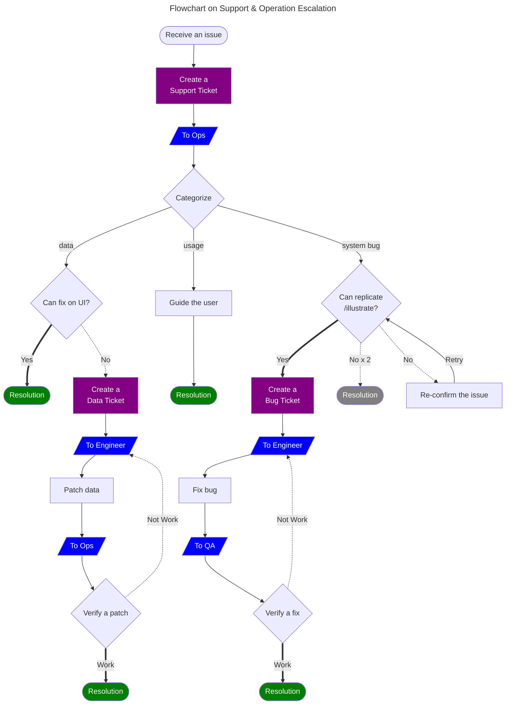

# Escalation

```mermaid
---
title: Flowchart on Support & Operation Escalation
---
flowchart
    %% events

    %% start point / termination points
    issue([Receive an issue])
    ui-data-resolution([Resolution])
    usage-resolution([Resolution])
    patch-data-resolution([Resolution])
    fix-resolution([Resolution])
    not-found-resolution([Resolution])

    %% process
    support-ticket[Create a\nSupport Ticket]
    usage-solution[Guide the user]
    patch-ticket[Create a\nData Ticket]
    patch-data[Patch data]
    bug-ticket[Create a \nBug Ticket]
    fix-bug[Fix bug]
    reconfirm[Re-confirm the issue]

    %% decision
    categorize{Categorize}
    data-solution{Can fix on UI?}
    system-bugs{Can replicate\n/illustrate?}
    data-verify{Verify a patch}
    verify{Verify a fix}

    %% change of operator
    ops-escalate[/To Ops/]
    data-ops-escalate[/To Ops/]
    data-eng-escalate[/To Engineer/]
    eng-escalate[/To Engineer/]
    qa-escalate[/To QA/]

    %% style
    style ops-escalate fill:blue,color:#fff
    style data-eng-escalate fill:blue,color:#fff
    style eng-escalate fill:blue,color:#fff
    style qa-escalate fill:blue,color:#fff
    style data-ops-escalate fill:blue,color:#fff
    style support-ticket fill:purple,color:#fff
    style patch-ticket fill:purple,color:#fff
    style bug-ticket fill:purple,color:#fff
    style ui-data-resolution fill:green,color:#fff
    style usage-resolution fill:green,color:#fff
    style patch-data-resolution fill:green,color:#fff
    style fix-resolution fill:green,color:#fff
    style not-found-resolution fill:gray,color:#fff

    %% assoications
    issue --> support-ticket
    support-ticket --> ops-escalate
    ops-escalate --> categorize

    categorize -->|data| data-solution
    categorize -->|usage| usage-solution
    categorize -->|system bug| system-bugs

    data-solution ==> |Yes| ui-data-resolution
    data-solution -.-> |No| patch-ticket

    usage-solution --> usage-resolution

    patch-ticket --> data-eng-escalate
    data-eng-escalate --> patch-data
    patch-data --> data-ops-escalate

    data-ops-escalate --> data-verify

    data-verify -.-> |Not Work| data-eng-escalate
    data-verify ==> |Work| patch-data-resolution

    system-bugs ==>  |Yes| bug-ticket
    bug-ticket --> eng-escalate
    eng-escalate --> fix-bug

    fix-bug --> qa-escalate
    qa-escalate --> verify

    verify -.-> |Not Work| eng-escalate
    verify ==> |Work| fix-resolution

    system-bugs -.->  |No x 2| not-found-resolution
    system-bugs -.->  |No| reconfirm
    reconfirm --> |Retry| system-bugs
```
