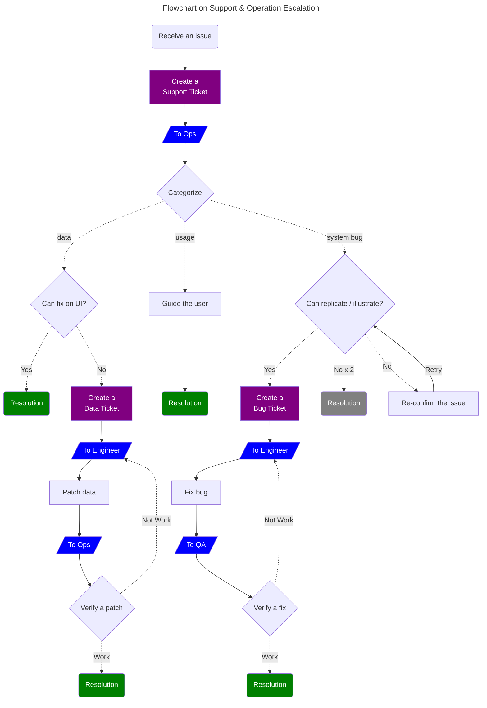

# Escalation

```mermaid
---
title: Flowchart on Support & Operation Escalation
---
flowchart
    style ops-escalate fill:blue,color:#fff
    
    style data-eng-escalate fill:blue,color:#fff
    style eng-escalate fill:blue,color:#fff
    
    style qa-escalate fill:blue,color:#fff
    style data-ops-escalate fill:blue,color:#fff

    style support-ticket fill:purple,color:#fff
    style patch-ticket fill:purple,color:#fff
    style bug-ticket fill:purple,color:#fff

    style ui-data-resolution fill:green,color:#fff
    style usage-resolution fill:green,color:#fff
    style patch-data-resolution fill:green,color:#fff
    style fix-resolution fill:green,color:#fff
    style not-found-resolution fill:gray,color:#fff

    issue(Receive an issue) --> support-ticket
    support-ticket[Create a\nSupport Ticket] --> ops-escalate
    ops-escalate[/To Ops/] --> categorize

    categorize{Categorize} -.->|data| data-solution{Can fix on UI?}
    categorize{Categorize} -.->|usage| usage-solution[Guide the user]
    categorize{Categorize} -.->|system bug| system-bugs{Can replicate / illustrate?}

    data-solution -.-> |Yes| ui-data-resolution(Resolution)
    data-solution -.-> |No| patch-ticket

    usage-solution --> usage-resolution(Resolution)

    patch-ticket[Create a\nData Ticket] --> data-eng-escalate
    data-eng-escalate[/To Engineer/] --> patch-data
    patch-data[Patch data] --> data-ops-escalate[/To Ops/]

    data-ops-escalate --> data-verify{Verify a patch}

    data-verify -.-> |Not Work| data-eng-escalate
    data-verify -.-> |Work| patch-data-resolution(Resolution)

    system-bugs -.->  |Yes| bug-ticket[Create a \nBug Ticket]
    bug-ticket --> eng-escalate
    eng-escalate[/To Engineer/] --> fix-bug

    fix-bug[Fix bug] --> qa-escalate
    qa-escalate[/To QA/] --> verify{Verify a fix}

    verify -.-> |Not Work| eng-escalate
    verify -.-> |Work| fix-resolution(Resolution)

    system-bugs -.->  |No x 2| not-found-resolution(Resolution)
    system-bugs -.->  |No| reconfirm[Re-confirm the issue]
    reconfirm --> |Retry| system-bugs
```
