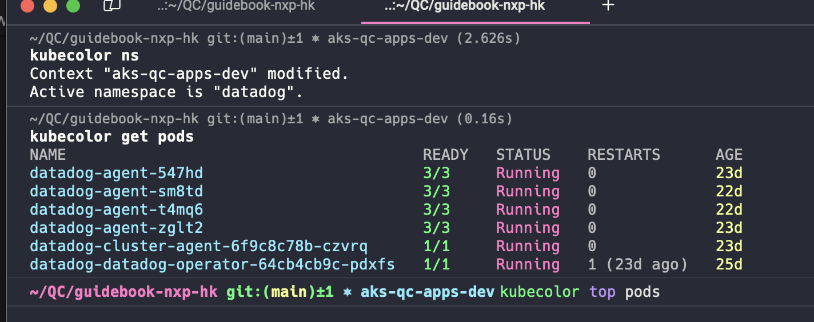

# Kubernetes Administration <!-- omit in toc -->

Table of Contents

- [Tools](#tools)
- [Plugins in Krew](#plugins-in-krew)
  - [Set up \& Installation](#set-up--installation)
  - [Set up](#set-up)
  - [How to use](#how-to-use)
    - [kubectx](#kubectx)
    - [kubens](#kubens)
    - [stern](#stern)
    - [kube-score](#kube-score)
    - [kube-allctx](#kube-allctx)
    - [kubectl-iexec](#kubectl-iexec)
    - [kor](#kor)
    - [kubescape](#kubescape)
    - [kubespy](#kubespy)
    - [kurt](#kurt)
    - [outdated](#outdated)
  - [Short Names](#short-names)

## Tools

- kubectl
  - to interact with the clusters
- azure-cli
  - to interact with all Azure Resources
- [krew](https://github.com/kubernetes-sigs/krew "https://github.com/kubernetes-sigs/krew")
  - to install convenient plugins for kubectl
- [kubecolor](https://kubecolor.github.io "https://kubecolor.github.io")
  - to colorize the output of kubectl



## Plugins in Krew

### Set up & Installation

```bash
alias k="kubectl"
alias kk="kubectl krew"

# or

alias k="kubecolor"
alias kk="kubecolor krew"
alias kgp="kubecolor get pod"
alias kgd="kubecolor get deployment"
alias kgcr="kubecolor get certificaterequest"
alias kgs="kubecolor get service"
alias kgi="kubecolor get ingress"

alias kdp="kubecolor describe pod"
alias kdd="kubecolor describe deployment"
alias kdcr="kubecolor describe certificaterequest"
alias kds="kubecolor describe service"
alias kdi="kubecolor describe ingress"

kk install ctx # switch between contexts easily
kk install ns # switch between namespaces easily
kk install stern # log tailing of multiple pods
kk install score # static manifest analyzer (good on CI/CD)
kk install allctx # fire commands to multiple contexts
kk install iexec # search and exec pod
kk install kor # discover unused resources
kk install kubescape # scan security vulnerability on resources (good on CI/CD)
kk install kubespy # temporarily add more libraries to the pod for debugging
kk install kurt # show all restarted resources
kk install outdated # detect what resources are outdated and show the latest version available
```

### Set up

```bash
PROMPT=$PROMPT'$(kube_ps1)'
```

### How to use

#### [kubectx](https://github.com/ahmetb/kubectx "https://github.com/ahmetb/kubectx")

- switch between contexts easily

```bash
k ctx # list all contexts
```

```bash
k ctx nexplore-dev # switch to context `nexplore-dev`
```

```bash
k ctx - # switch to the previous context
```

#### [kubens](https://github.com/ahmetb/kubectx "https://github.com/ahmetb/kubectx")

- switch between namespaces easily

```bash
k ns # list all namespaces
```

```bash
k ns core # switch to namespace core
```

#### [stern](https://github.com/rancher/stern "https://github.com/rancher/stern")

- log tailing of multiple pods

```bash
k stern apps -A  # log tailing all components with pattern `apps`
```

#### [kube-score](https://github.com/zegl/kube-score "https://github.com/zegl/kube-score")

- static manifest analyzer, can be used with CI/CD

```bash
helm template my-app | kube-score score -
```

#### [kube-allctx](https://github.com/onatm/kubectl-allctx "https://github.com/onatm/kubectl-allctx")

- fire commands to multiple contexts

```bash
k allctx get pods --like apps -A
```

#### [kubectl-iexec](https://github.com/gabeduke/kubectl-iexec "https://github.com/gabeduke/kubectl-iexec")

- search and exec pod

```bash
k iexec app # will show a list to select

# Use the arrow keys to navigate: ↓ ↑ → ←
# ? Select Pod:
#   Namespace: app | Pod: ▸ app-5d4c8755cb-aaaaa
#   Namespace: app | Pod: app-5d4c8755cb-bbbbb
# ↓ Namespace: app | Pod: app-background-job-6b577d899f-gnq4s
```

#### [kor](https://github.com/yonahd/kor "https://github.com/yonahd/kor")

- discover unused resources

```bash
k kor all
```

#### [kubescape](https://github.com/kubescape/kubescape "https://github.com/kubescape/kubescape")

- scan security vulnerability on resources, operator is also available

```bash
k kubescape scan
```

#### [kubespy](https://github.com/huazhihao/kubespy "https://github.com/huazhihao/kubespy")

- temporarily add more libraries to the pod for debugging

```bash
k spy my-app -n app
```

#### [kurt](https://github.com/soraro/kurt "https://github.com/soraro/kurt")

- show all restarted resources

```bash
k kurt all

# kurt: Kubernetes Restart Tracker

# ==========

#  Namespace Restarts

#  datadog  3
#  helloworld  1
#  foobar  0
#  core 0
#  keycloak  0

# ==========

#  Node Restarts

#  aks-d4sv5-29292033-vmss000000  4
#  aks-d4sv5-29292033-vmss00000a  0
#  aks-d4sv5-29292033-vmss000002  0
#  aks-d4sv5-29292033-vmss000004  0

# ==========

#  Label       Restarts

#  pod-template-generation:2    3
#  app.kubernetes.io/instance:datadog-agent 3
#  app.kubernetes.io/name:datadog-agent  3
#  app.kubernetes.io/managed-by:Helm   3
#  app.kubernetes.io/component:agent   3

# ==========

#  Pod      Namespace Restarts

#  datadog-agent-zwhd9 datadog  3
#  helloworld-backend-7576dcc5cd-g7tpp  helloworld  1
#  foobar-backend-7bd76cbbc5-jsjsz   foobar  0
#  smalltown-backend-769555d79c-7qwlm  smalltown  0
#  sleepyday-backend-6499b67b87-r96x8 sleepyday  0
```

#### [outdated](https://github.com/replicatedhq/outdated "https://github.com/replicatedhq/outdated")

- detect what resources are outdated and show the latest version available

```bash
k outdated

# Image                                                  Current               Latest               Behind
# nexplore.azurecr.io/flagship/inspection-b...     prod-26           Unable to get image data
# quay.io/jetstack/cert-manager-controller               v1.11.1               4.0.0-c875c7         3
# quay.io/jetstack/cert-manager-cainjector               v1.11.1               4.0.0-f67c80         3
# quay.io/jetstack/cert-manager-webhook                  v1.11.1               4.0.0-c875c7         3
```

### Short Names

```shell
kubectl api-resources

# NAME                                SHORTNAMES          APIVERSION                             NAMESPACED   KIND
# bindings                                                v1                                     true         Binding
# componentstatuses                   cs                  v1                                     false        ComponentStatus
# configmaps                          cm                  v1                                     true         ConfigMap
# endpoints                           ep                  v1                                     true         Endpoints
# events                              ev                  v1                                     true         Event
# limitranges                         limits              v1                                     true         LimitRange
```

e.g.

- `deploy` - deployment
- `po` - pod
- `cr` - certificaterequest
- `ing` - ingress
- `svc` - service
- `ns` - namespace
- `no` - node
