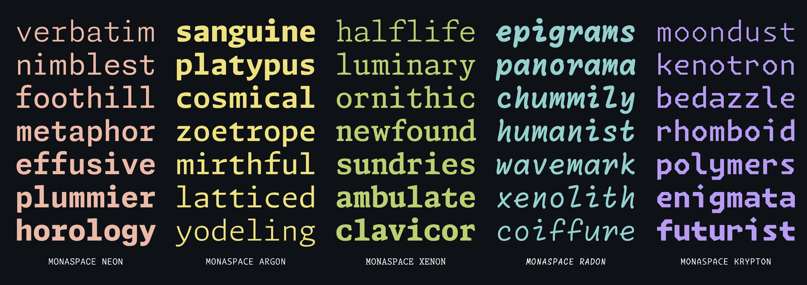
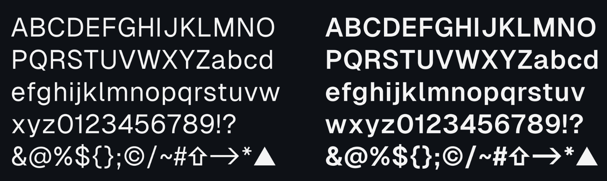

# Developer Productivity <!-- omit in toc -->

Table of Contents

- [Fonts](#fonts)
- [Terminal](#terminal)
  - [Plugins](#plugins)
- [Git](#git)
- [Editors](#editors)
- [The Soft Parts](#the-soft-parts)

## Fonts

- [Monaspace](https://monaspace.githubnext.com/?fbclid=IwZXh0bgNhZW0CMTEAAR3EO3yFjT9oZzBcmbYgQ7dkhwHOFrXFaCvQpR525xZP11Z--8GXI3r4Yu4_aem_ZmFrZWR1bW15MTZieXRlcw "https://monaspace.githubnext.com/?fbclid=IwZXh0bgNhZW0CMTEAAR3EO3yFjT9oZzBcmbYgQ7dkhwHOFrXFaCvQpR525xZP11Z--8GXI3r4Yu4_aem_ZmFrZWR1bW15MTZieXRlcw")




- [Fira Code](https://github.com/tonsky/FiraCode "https://github.com/tonsky/FiraCode")


- [JetBrains Monospace](https://www.jetbrains.com/lp/mono "https://www.jetbrains.com/lp/mono")


- [Vercel - Geist](https://github.com/vercel/geist-font "https://github.com/vercel/geist-font")



## Terminal

- [zsh](https://www.zsh.org "https://www.zsh.org") - original, fast
  - command + t (create tabs)
  - command + shift + [ OR ] (move across tabs)
- [Warp](https://www.warp.dev "https://www.warp.dev") - can split panes
  - command + d (split horizontally)
  - command + shift + d (split vertically)
  - command + option + navigation (<>^v) (move across panes)
  - `expand aliases as you type` (Alias expansion)
- [Tmux](https://github.com/tmux/tmux/wiki "https://github.com/tmux/tmux/wiki")
- [iTerm2](https://iterm2.com "https://iterm2.com")

### Plugins

- [bat](https://github.com/sharkdp/bat) - replace `cat`
- `cal`
- [fzf](https://github.com/junegunn/fzf "https://github.com/junegunn/fzf")
- [krew](../how-we-operate/kubernetes-admin.md "../how-we-operate/kubernetes-admin.md")
- [oh-my-zsh](https://ohmyz.sh "https://ohmyz.sh")
- [powerlevel10k](https://github.com/romkatv/powerlevel10k "https://github.com/romkatv/powerlevel10k")
- [tree](<https://en.wikipedia.org/wiki/Tree_(command)>)
- [zoxide](https://github.com/ajeetdsouza/zoxide "https://github.com/ajeetdsouza/zoxide")
- [zsh-completion](https://github.com/zsh-users/zsh-completions "https://github.com/zsh-users/zsh-completions")

```bash
source ~/.zshrc

alias j="z" # zoxide
alias ji="zi" # zoxide
```

```bash
code $(ji)
code $(fzf)
```

## Git

- check [here](../how-we-develop/github.md) and [here](../how-we-develop/git-workflow.md)

- [git](https://kapeli.com/cheat_sheets/Oh-My-Zsh_Git.docset/Contents/Resources/Documents/index "https://kapeli.com/cheat_sheets/Oh-My-Zsh_Git.docset/Contents/Resources/Documents/index")

## Editors

- [VIM](https://www.vim.org "https://www.vim.org")
- [NeoVIM](https://neovim.io "https://neovim.io")

  ```bash
  vimtutor
  ```

- [Visual Studio Code](../what-we-use/vs-code.md)

## The Soft Parts

- [So you want to be a wizard](https://wizardzines.com/zines/wizard "https://wizardzines.com/zines/wizard")
- [The Pocket Guide to Debugging](https://wizardzines.com/zines/debugging-guide "https://wizardzines.com/zines/debugging-guide")
