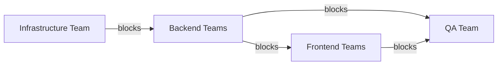

# Schema First API Design <!-- omit in toc -->

Table of Contents

- [Problem Statement](#problem-statement)
- [Unblocking Teams](#unblocking-teams)
- [Task Separation on Backend (For big tasks)](#task-separation-on-backend-for-big-tasks)
- [When to be ready?](#when-to-be-ready)
- [Facilitator](#facilitator)
- [Challenges](#challenges)
- [Further Discussion](#further-discussion)
- [Reference](#reference)

## Problem Statement

Some teams are more critical than the other teams to affect the overall delivery schedule

## Unblocking Teams

- To Backend teams, API is the Final Product
- To shorten the lifecycle, we provide Mock APIs with the agreed interfaces
- Teams can work on the expected deliveries together

## Task Separation on Backend (For big tasks)

One story can split into three types of tasks

1. Mock APIs
   - new APIs added
   - make sure the interfaces are agreed
2. DB
   - how the fields changed
   - what indices added
   - what constraints applied
3. Business Logic
   - change of existing business logic, or replace mock implementation on mock APIs

## When to be ready?

Before the sprint starts

## Facilitator

- change of API interfaces
  - [Swagger Module](https://docs.nestjs.com/openapi/introduction) in NestJS can generate OpenAPI 3.0 Specification in JSON
    - a script can generate the latest OpenAPI 3.0 Specification when a new commit has created locally
- change of database structures
  - [mermerd](https://github.com/KarnerTh/mermerd) will run daily to generate the latest schema and create a pull request

## Challenges

- Cannot guarantee the mock interfaces the same to the final products
  - Uncertainties on wrong work
- Overlook some tasks
  - Mock APIs cannot reflect all the interactions
- Introduce more communication overhead
- Be adaptive to change
  - Maintain the same style
  - Adhere to the industrial standards

## Further Discussion

- [Automate API deployments with APIOps](https://learn.microsoft.com/en-us/azure/architecture/example-scenario/devops/automated-api-deployments-apiops "https://learn.microsoft.com/en-us/azure/architecture/example-scenario/devops/automated-api-deployments-apiops")

## Reference

- [Designing APIs with Swagger and OpenAPI](https://www.manning.com/books/designing-apis-with-swagger-and-openapi "https://www.manning.com/books/designing-apis-with-swagger-and-openapi")
- [OpenAPI Initiative](https://www.openapis.org)
