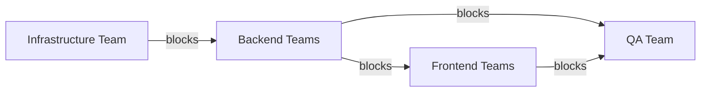

# Schema First API Design

## Problem Statement
- Some teams are more critical than the other teams to affect the overall delivery schedule

## Unblocking Teams
- To Backend teams, API is the Final Product
- To shorten the lifecycle, we provide Mock APIs with the agreed interfaces
- Teams can work on the expected deliveries together

## Task Separation on Backend (Trial)

One story can split into three types of tasks

1. Mock APIs
    - new APIs added
    - make sure the interfaces are discussed
2. DB
    - how the fields changed
    - what indices added
    - what constraints applied
3. Logic
    - change of existing business logic, or replace mock implementation on mock APIs

## When to be ready?

- Before the sprint starts

## Work In Progress

- Set up the ChatOps for
    - change of database structures
    - change of API interfaces

## Challenges

- Cannot guarantee the mock interfaces the same to the final products
    - Uncertainies on wrong work 
- Overlook some tasks
    - Mock APIs cannot reflect all the interactions
- Introduce more communication overhead
- Be adaptive to change
    - Maintain the same style
    - Adhere to the industrial standards

## Further Discussion

- [Automate API deployments with APIOps](https://learn.microsoft.com/en-us/azure/architecture/example-scenario/devops/automated-api-deployments-apiops "https://learn.microsoft.com/en-us/azure/architecture/example-scenario/devops/automated-api-deployments-apiops")

## Reference

- [Designing APIs with Swagger and OpenAPI](https://www.manning.com/books/designing-apis-with-swagger-and-openapi "https://www.manning.com/books/designing-apis-with-swagger-and-openapi")
