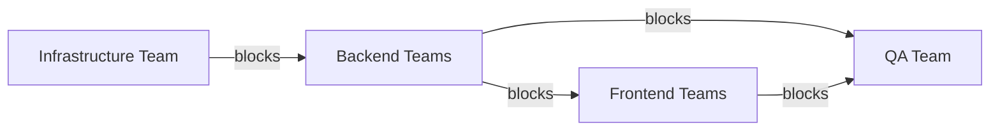

# Schema First API Design <!-- omit in toc -->

**Table of Contents**

- [1. Problem Statement](#1-problem-statement)
- [2. Unblocking Teams](#2-unblocking-teams)
- [3. Task Separation on Backend (Trial)](#3-task-separation-on-backend-trial)
- [4. When to be ready?](#4-when-to-be-ready)
- [5. Work In Progress](#5-work-in-progress)
- [6. Challenges](#6-challenges)
- [7. Further Discussion](#7-further-discussion)
- [8. Reference](#8-reference)

## 1. Problem Statement

- Some teams are more critical than the other teams to affect the overall delivery schedule

## 2. Unblocking Teams

- To Backend teams, API is the Final Product
- To shorten the lifecycle, we provide Mock APIs with the agreed interfaces
- Teams can work on the expected deliveries together

## 3. Task Separation on Backend (Trial)

One story can split into three types of tasks

1. Mock APIs
   - new APIs added
   - make sure the interfaces are agreed
2. DB
   - how the fields changed
   - what indices added
   - what constraints applied
3. Logic
   - change of existing business logic, or replace mock implementation on mock APIs

## 4. When to be ready?

- Before the sprint starts

## 5. Work In Progress

- Set up the ChatOps for
  - change of database structures
  - change of API interfaces

## 6. Challenges

- Cannot guarantee the mock interfaces the same to the final products
  - Uncertainties on wrong work
- Overlook some tasks
  - Mock APIs cannot reflect all the interactions
- Introduce more communication overhead
- Be adaptive to change
  - Maintain the same style
  - Adhere to the industrial standards

## 7. Further Discussion

- [Automate API deployments with APIOps](https://learn.microsoft.com/en-us/azure/architecture/example-scenario/devops/automated-api-deployments-apiops "https://learn.microsoft.com/en-us/azure/architecture/example-scenario/devops/automated-api-deployments-apiops")

## 8. Reference

- [Designing APIs with Swagger and OpenAPI](https://www.manning.com/books/designing-apis-with-swagger-and-openapi "https://www.manning.com/books/designing-apis-with-swagger-and-openapi")
