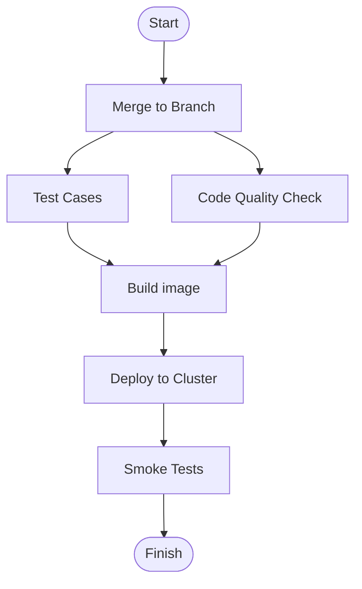

# Smoke Tests

## What is it?

- A QUICK, SIMPLE and most critical test cases to verify the system is working properly

## Playwright

- [Playwright](https://playwright.dev "https://playwright.dev")
- a test framework that can simulate how we interact with browsers automatically

## Playwright - what it offers

- provide nodejs runtime
- be fast to start
- can run in parallel
- auto-wait until components are ready
- support test execution recording & screen capture
- support test recording

## Test Workflow



## How do we execute the smoke tests?

- Go to all the pages user will see and see if we can load the content correctly

## Tips on Playwright

- Unlike jest, All matchers are `contains`. If you check the exact value, use `exact: true`
```typescript
  ...


  ...

```

`async matchers` vs `generic matchers`3

Fixture	Type	Description
page	Page	Isolated page for this test run.
context	BrowserContext	Isolated context for this test run. The page fixture belongs to this context as well. Learn how to configure context.
browser	Browser	Browsers are shared across tests to optimize resources. Learn how to configure browser.
browserName	string	The name of the browser currently running the test. Either chromium, firefox or webkit.
request	APIRequestContext	Isolated APIRequestContext instance for this test run.

name = contain
exact: true

- Use Soft assertions
  - If your test fails, Playwright will give you an error message showing what part of the test failed which you can see either in VS Code, the terminal, the HTML report, or the trace viewer. However, you can also use soft assertions. These do not immediately terminate the test execution, but rather compile and display a list of failed assertions once the test ended.

  ```typescript
  // Make a few checks that will not stop the test when failed...
  await expect.soft(page.getByTestId('status')).toHaveText('Success');

  // ... and continue the test to check more things.
  await page.getByRole('link', { name: 'next page' }).click();
  ```


tag <- can be filtered ()

npx playwright test --grep "@fast|@slow"
npx playwright test --grep "(?=.*@fast)(?=.*@slow)"
- https://playwright.dev/docs/best-practices
What you see is what you test


## Avoid to run same action to run for each test

Sometime we only want to run some actions once through the test execution. e.g. Authentication 

- Use Case: Authentication

1. Update auth as a new `project` in `playwright.config.ts`

   ```typescript
  import { defineConfig, devices } from '@playwright/test';

  export default defineConfig({
    projects: [
      // Step 1: Setup project
      { name: 'setup', testMatch: /.*\.setup\.ts/ }, 

      {
        name: 'chromium',
        use: {
          ...devices['Desktop Chrome'],
          // Step 2: Specify where to store the auth information
          storageState: 'playwright/.auth/user.json',
        },
        dependencies: ['setup'],
      },
    ],
  });
  ```
2. Add `login.setup.ts`

  ```typescript
  import { test as setup } from '@playwright/test';
  import { getConfiguration } from '../configs/getConfiguration';

  const { CORE_FRONTEND_ENDPOINT } = getConfiguration();
  const AUTH_FILE = 'playwright/.auth/user.json';

  setup('Login', async ({ page }) => {
    await page.goto(CORE_FRONTEND_ENDPOINT);
    await page
      .getByPlaceholder('Email')
      .fill(process.env.USER_EMAIL);
    await page
      .getByPlaceholder('Password')
      .fill(process.env.USER_PASSWORD);
    await page.getByRole('button', { name: 'Log In' }).click();

    await page.context().storageState({ path: AUTH_FILE });
  });
  ```
3. Exclude the auth session file in git

  ```bash
  mkdir -p playwright/.auth
  echo $'\nplaywright/.auth' >> .gitignore
  ```


Extract from: https://playwright.dev/docs/auth


# How other people do the smoke tests

# Reference

- https://learn.microsoft.com/en-us/training/modules/build-with-playwright
- https://www.youtube.com/@Playwrightdev
- https://playwright.dev/docs/test-fixtures
- [VS Code](https://github.com/microsoft/vscode/wiki/Smoke-Test)

- https://en.wikipedia.org/wiki/Smoke_testing_(software)
