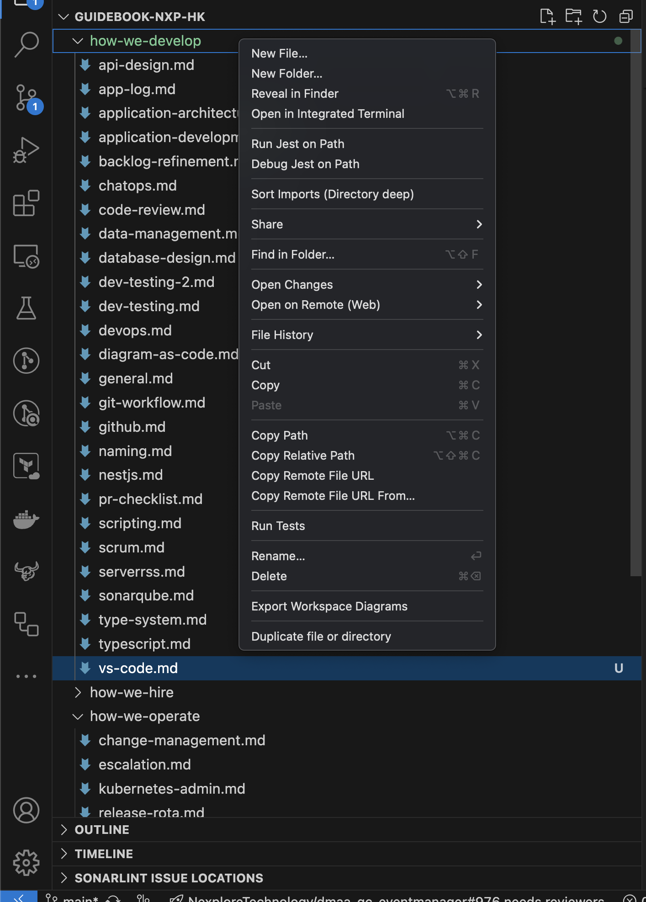
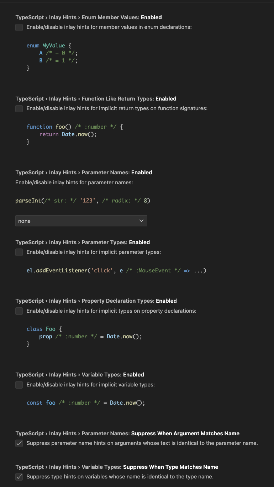
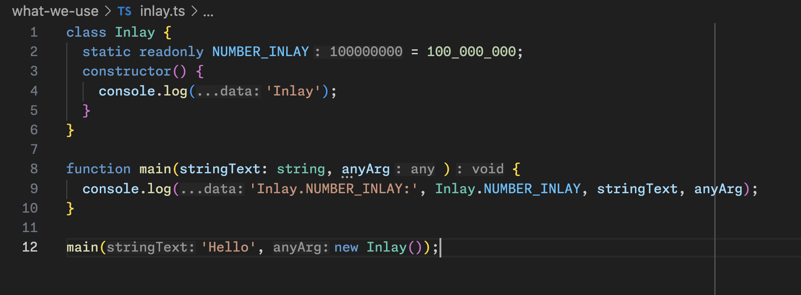
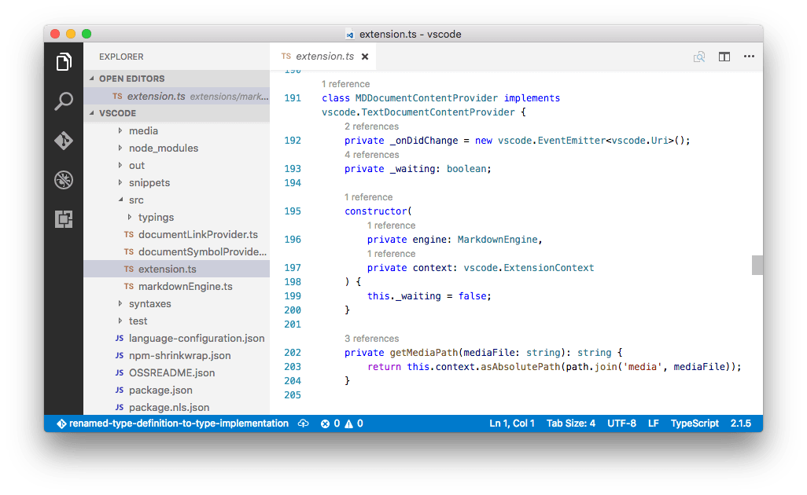

# Visual Studio Code <!-- omit in toc -->

Table of Contents

- [Tutorial](#tutorial)
- [Extensions](#extensions)
  - [Code Spell Checker](#code-spell-checker)
  - [Batch Rename](#batch-rename)
  - [Error Lens](#error-lens)
  - [Pretty TypeScript Errors](#pretty-typescript-errors)
  - [SonarLint](#sonarlint)
  - [jwt-decode](#jwt-decode)
  - [Duplicate Action](#duplicate-action)
  - [GitLens](#gitlens)
  - [Unix Time Converter](#unix-time-converter)
  - [Better Comments](#better-comments)
  - [Live Share](#live-share)
  - [Polacode 2022](#polacode-2022)
  - [Markdown All in One](#markdown-all-in-one)
  - [Paste JSON as Code](#paste-json-as-code)
  - [Sort JSON Objects](#sort-json-objects)
- [Shortcuts](#shortcuts)
- [Settings](#settings)
- [Markdown](#markdown)
- [GitHub Copilot](#github-copilot)
  - [The Inspiration](#the-inspiration)
  - [Autocompletion](#autocompletion)
  - [Chat](#chat)
    - [Inline Chat](#inline-chat)
    - [Sidebar Chat](#sidebar-chat)
    - [Voice Chat](#voice-chat)
  - [Three Ss](#three-ss)
- [Recommended set up on repositories](#recommended-set-up-on-repositories)
- [Reference](#reference)

## Tutorial

> Open the Welcome page from the Help > Editor Playground menu or use the Help: Interactive Editor Playground command from the Command Palette (⇧⌘P).

## Extensions

- Most of the images are from the original plugin page

### [Code Spell Checker](https://marketplace.visualstudio.com/items?itemName=streetsidesoftware.code-spell-checker "https://marketplace.visualstudio.com/items?itemName=streetsidesoftware.code-spell-checker")


- find spelling mistakes

---

### [Batch Rename](https://marketplace.visualstudio.com/items?itemName=JannisX11.batch-rename-extension "https://marketplace.visualstudio.com/items?itemName=JannisX11.batch-rename-extension")


- Rename multiple files easily

---

### [Error Lens](https://marketplace.visualstudio.com/items?itemName=usernamehw.errorlens "https://marketplace.visualstudio.com/items?itemName=usernamehw.errorlens")


- Display error at the end of the line

---

### [Pretty TypeScript Errors](https://marketplace.visualstudio.com/items?itemName=yoavbls.pretty-ts-errors "https://marketplace.visualstudio.com/items?itemName=yoavbls.pretty-ts-errors")


- Wrap the error in a more readable way

---

### [SonarLint](https://marketplace.visualstudio.com/items?itemName=SonarSource.sonarlint-vscode "https://marketplace.visualstudio.com/items?itemName=SonarSource.sonarlint-vscode")


- Provide additional recommendations other than eslint
- Further set up please refer to [here](./sonarqube.md "./sonarqube.md")

---

### [jwt-decode](https://marketplace.visualstudio.com/items?itemName=jflbr.jwt-decoder "https://marketplace.visualstudio.com/items?itemName=jflbr.jwt-decoder")


- Decode JWT Token in VSCode

---

### [Duplicate Action](https://marketplace.visualstudio.com/items?itemName=mrmlnc.vscode-duplicate "https://marketplace.visualstudio.com/items?itemName=mrmlnc.vscode-duplicate")



- Click `Duplicate File or Directory` to duplicate the whole target group

---

### [GitLens](https://marketplace.visualstudio.com/items?itemName=eamodio.gitlens "https://marketplace.visualstudio.com/items?itemName=eamodio.gitlens")


- Show who has edited the code before

---

### [Unix Time Converter](https://marketplace.visualstudio.com/items?itemName=espresso3389.unixtime-converter "https://marketplace.visualstudio.com/items?itemName=espresso3389.unixtime-converter")


- Convert unix timestamp to readable time

---

### [Better Comments](https://marketplace.visualstudio.com/items?itemName=aaron-bond.better-comments "https://marketplace.visualstudio.com/items?itemName=aaron-bond.better-comments")


- Highlight common TODO phrases

---

### [Live Share](https://marketplace.visualstudio.com/items?itemName=MS-vsliveshare.vsliveshare "https://marketplace.visualstudio.com/items?itemName=MS-vsliveshare.vsliveshare")


- Live sharing and collaboration tool on VScode

---

### [Polacode 2022](https://marketplace.visualstudio.com/items?itemName=jeff-hykin.polacode-2019 "https://marketplace.visualstudio.com/items?itemName=jeff-hykin.polacode-2019")

- Extract code segments as beautiful images


---

### [Markdown All in One](https://marketplace.visualstudio.com/items?itemName=yzhang.markdown-all-in-one "https://marketplace.visualstudio.com/items?itemName=yzhang.markdown-all-in-one")

- Extra support on markdown

---

### [Paste JSON as Code](https://marketplace.visualstudio.com/items?itemName=quicktype.quicktype "https://marketplace.visualstudio.com/items?itemName=quicktype.quicktype")

- JSON with interfaces in typescript


---

### [Sort JSON Objects](https://marketplace.visualstudio.com/items?itemName=richie5um2.vscode-sort-json "https://marketplace.visualstudio.com/items?itemName=richie5um2.vscode-sort-json")

- Sort JSON Objects


## Shortcuts

- Extract Variables & Functions
- Rename Symbols
- Text Selection
  - After selected the text and do a right-click, the menu on the selected text and number bar is completely different
- Dart Refactoring, check [here](https://dartcode.org/docs/refactorings-and-code-fixes "https://dartcode.org/docs/refactorings-and-code-fixes")

- [Refactoring Tips](https://code.visualstudio.com/docs/editor/refactoring "https://code.visualstudio.com/docs/editor/refactoring")
- open `Settings` - `cmd` + `,`
- Split editor: `cmd` + `\`
- Move across editor: `cmd` + `option` + `<` / `>`

- Change Cases with `cmd + p` + `>`, e.g. smart boy
  - `Transform to Kebab Case` - smart-boy
  - `Transform to Lowercase` - smartboy
  - `Transform to Uppercase` - SMARTBOY
  - `Transform to Snake Case` - smart_boy
  - `Transform to Camel Case` - smartBoy
  - `Transform to Pascal Case` - SmartBoy
  - `Transform to Title Case` - Smartboy

- `cmd` + `p` AND
  - `>` - Command mode
  - `@` - local symbol search
  - `#` - global symbol search

## Settings

```json
{
  // * TypeScript Inlay Hints
  // Show inference arguments & types in ghost text

  "typescript.inlayHints.parameterNames.enabled": "all",
  "typescript.inlayHints.variableTypes.enabled": true, // highly recommended
  "typescript.inlayHints.propertyDeclarationTypes.enabled": true,
  "typescript.inlayHints.parameterTypes.enabled": true, // highly recommended
  "typescript.inlayHints.functionLikeReturnTypes.enabled": true, // highly recommended

  // Update import paths when moved
  "javascript.updateImportsOnFileMove.enabled": "always",
  "typescript.updateImportsOnFileMove.enabled": "always",

  // * TypeScript Reference Code Lens
  "typescript.referencesCodeLens.enabled": true,

  // * TypeScript Implementation Code Lens
  // Useful on OOP Style
  "typescript.implementationsCodeLens.showOnInterfaceMethods": true,

  // * Typescript Path
  "typescript.preferences.importModuleSpecifier": "non-relative",

  // * Dart Inlay Hints
  // Show inference arguments & types in ghost text
  // Shortcut - `ctrl` + `opt`
  "[dart]": {
    // 'off' - never show
    // 'on' - always show
    // 'offUnlessPressed' - show only while shortcut keys are held down (default)
    // 'onUnlessPressed' - show, but hide while shortcut keys are held down
    "editor.inlayHints.enabled": "offUnlessPressed"
  },

  // * TSX / XML / HTML
  // Auto rename the closing tag when the open tag has updated
  "editor.linkedEditing": true,

  // Brackets with color lines
  "editor.guides.bracketPairs": true

  // * Ruler
  "editor.rulers": [100], // can have multiple ruler

  // * Sticky Scroll
  "editor.stickyScroll.scrollWithEditor": true, // on editor
  "workbench.tree.enableStickyScroll": true, // on document ree

  // * Auto-hide on Mini-map
  "editor.minimap.autohide": true, // might not be very useful to someone, need to set folding markers
  "editor.minimap.size": "fill",

  // * Auto newline
  "files.insertFinalNewline": true, // respect lint settings
  "files.trimTrailingWhitespace": true, // respect lint settings

  // * Auto Save
  "files.autoSaveWhenNoErrors": true,
  "files.autoSave": "onFocusChange",  // Save if lose focus

  // save space
  "workbench.tree.indent": 4,
}
```

- Inlay Hints

  
  

- Reference Code Lens

  

- Ruler
- Word Wrap
- Autosave

- [Typescript Editing](https://code.visualstudio.com/docs/typescript/typescript-editing "https://code.visualstudio.com/docs/typescript/typescript-editing")

## Markdown

1. Shortcuts

    ```markdown
    // bang bang will show all the headers in workspace to be selected
    [here](##)
    ```

2. Drag the image / video to the editor AND hold `shift` to link it

## GitHub Copilot

### The Inspiration

- It is a tool to help engineers to focus on `ideas` and `testing`
- Less focus on syntax
- Copilot does not know something it does not know (Hallucination)


### Autocompletion

1. ghost text
   - type the function name
   - type the comment
     - purpose
     - input
     - output

| Usage                 | Windows            | Mac                   |
| --------------------- | ------------------ | --------------------- |
| Accept suggestion     | `tab`              | `tab`                 |
| Accept partially      | `ctrl` + `>`       | `cmd` + `>`           |
| Alternate suggestions | `alt` + `[` or `]` | `option` + `[` or `]` |
| All suggestions       | `ctrl` + `enter`   | `ctrl` + `enter`      |

### Chat

- use `@terminal`, `@vscode` and `@workspace`
- point to files by `#file:someFileName`, `#editor` and `#selection`

#### Inline Chat

- `ctrl` / `cmd` + `I`

```typescript
// q: what is software engineering?
```

#### Sidebar Chat


- Code copilot in the terminal

```bash
/fix
/tests
/explain
/git
```

#### Voice Chat


- `ctrl` / `cmd` + `I` AND `ctrl` / `cmd` + `I`

### Three Ss

- Simple
  - keep the intention simple
- Specific
  - keep the expected code generated to produce a few lines
- Short
  - only one to two sentences each time and words in each sentence should be minimal

- copilot will give more score to files you open
- highlight the code

## Recommended set up on repositories

- File Path: `.vscode/settings.json`

API

```json
{
  "recommendations": [
    "aaron-bond.better-comments",
    "dbaeumer.vscode-eslint",
    "eamodio.gitlens",
    "firsttris.vscode-jest-runner",
    "GitHub.copilot-chat",
    "GitHub.copilot",
    "JannisX11.batch-rename-extension",
    "jeff-hykin.polacode-2019",
    "mrmlnc.vscode-duplicate",
    "MS-vsliveshare.vsliveshare",
    "orta.vscode-jest",
    "quicktype.quicktype",
    "richie5um2.vscode-sort-json",
    "SonarSource.sonarlint-vscode",
    "streetsidesoftware.code-spell-checker",
    "usernamehw.errorlens",
    "yoavbls.pretty-ts-errors",
    "yzhang.markdown-all-in-one",
  ]
}
```

Web

```json
{
  "recommendations": [
    "aaron-bond.better-comments",
    "dbaeumer.vscode-eslint",
    "eamodio.gitlens",
    "firsttris.vscode-jest-runner",
    "GitHub.copilot-chat",
    "GitHub.copilot",
    "JannisX11.batch-rename-extension",
    "jeff-hykin.polacode-2019",
    "meganrogge.template-string-converter",
    "mrmlnc.vscode-duplicate",
    "MS-vsliveshare.vsliveshare",
    "orta.vscode-jest",
    "quicktype.quicktype",
    "richie5um2.vscode-sort-json",
    "SonarSource.sonarlint-vscode",
    "streetsidesoftware.code-spell-checker",
    "usernamehw.errorlens",
    "yoavbls.pretty-ts-errors",
    "yzhang.markdown-all-in-one",
  ]
}
```

Mobile

```json
{
  "recommendations": [
    "aaron-bond.better-comments",
    "dart-code.dart-code",
    "dart-code.flutter",
    "eamodio.gitlens",
    "GitHub.copilot-chat",
    "GitHub.copilot",
    "JannisX11.batch-rename-extension",
    "jeff-hykin.polacode-2019",
    "mrmlnc.vscode-duplicate",
    "MS-vsliveshare.vsliveshare",
    "quicktype.quicktype",
    "richie5um2.vscode-sort-json",
    "SonarSource.sonarlint-vscode",
    "streetsidesoftware.code-spell-checker",
    "usernamehw.errorlens",
    "vscjava.vscode-gradle",
    "yzhang.markdown-all-in-one",
  ]
}

```

## Reference

- [GitHub Copilot in VS Code](https://code.visualstudio.com/docs/copilot/overview "https://code.visualstudio.com/docs/copilot/overview")
- [Getting started with GitHub Copilot](https://github.com/features/copilot/getting-started "https://github.com/features/copilot/getting-started")
- [Learn AI-Assisted Python Programming](https://www.manning.com/books/learn-ai-assisted-python-programming "https://www.manning.com/books/learn-ai-assisted-python-programming")
- [Top 5 Serious Time Savers in VS Code](https://www.youtube.com/watch?v=MLvLiWueESY "https://www.youtube.com/watch?v=MLvLiWueESY*")
- [How I Set Up VS Code](https://www.youtube.com/watch?v=85q9FTdVyJs "https://www.youtube.com/watch?v=85q9FTdVyJs")
